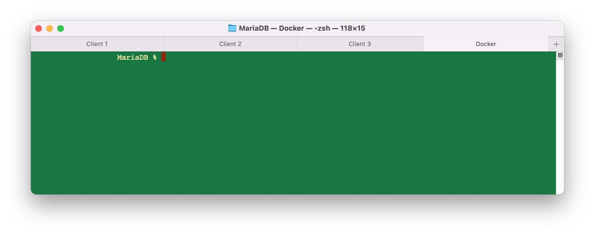

# MariaDB Replication on Docker

## Prepare the workshop

### Create a Docker network

This new network will hold the MariaDB server containers. We need to create a new network so we benefit from Docker’s [embedded DNS server](https://docs.docker.com/v17.09/engine/userguide/networking/configure-dns/). If the container runs in a custom network, a DNS server is always available at `127.0.0.11` and will adhere to the host’s DNS resolution configuration.

1. Open a `terminal`or a `shell` and create the new Docker network.
```console
docker network create --driver=bridge --subnet=172.31.1.0/24 --gateway=172.31.1.1 --ip-range 172.31.1.224/27 MariaDB
```
The `DHCP scope` is from 172.31.1.224 to 172.31.1.254. The rest of the range is mainly for static IP assignment. The servers will have a static IP address and the clients will have a DHCP assigned IP address.

2. Check to make sure that the Docker network as been created.
```console
docker network ls
```
	NETWORK ID     NAME      DRIVER    SCOPE
	48ad34c27bcf   MariaDB   bridge    local

### Create the `databases`directory tree

 1. Open a `terminal` or a `shell` and change to the directory for this workshop.
```console
cd <my/workshop/directory>
```
 2. Create the directory structure for the databases and configuration files for each MariaDB server.
```console
mkdir -p databases/{master1,master2,slave1}/mysql
```
The directory structure looks like this:

	databases
		|____master1
		|   |____mysql
		|____master2
		|   |____mysql
		|____slave1
		|   |____mysql

### Copy the configuration files from an official MariaDB image

In this section we just start a MariaDB instance to copy the configuration files from the container to our local directories. When we're done, we terminate this instance.

1. Open a `terminal`or a `shell` and start a temporary MariaDB instance.
```console
docker run -d --name mariadb --env MARIADB_ROOT_PASSWORD=my-secret-pw mariadb
```
2. Copy the original configuration files from the **container**, created in the preceding step, to the **local** server's configuration directory:
```console
docker cp mariadb:/etc/mysql/mariadb.conf.d/ databases/master1
docker cp mariadb:/etc/mysql/mariadb.conf.d/ databases/master2
docker cp mariadb:/etc/mysql/mariadb.conf.d/ databases/slave1
```
3. Terminate the container:
```console
docker rm -f mariadb
```
### Set directory permission

The directories `databases/{master1,master2,slave1}/mysql` holds the MariaDB system and user's databases. Depending on your OS, you might need to change the permissions. This is the case on macOS.

1. Sets the permissions on the `mysql` directory.
```console
chmod -R 1777 databases/{master1,master2,slave1}/mysql
```
If directory permission is not set, you'll get the following error when you try to start the client:

	2022-01-01  00:00:00 3 [Warning] Aborted connection 1 to db: 'unconnected' user: 'unauthenticated' host: '172.31.1.1' (This connection closed normally without authentication)


## Configure each MariaDB server

### MariaDB: Configuration of `Master1` Server

1. Edit the configuration file in `databases/master1/mariadb.conf.d/50-server.cnf`. Insert the followings lines after the tag `[mysqld]`near line #9.

       #
       # * replication setting
       #
       server_id           = 1 # unique number for each MariaDB/MySQL server in your network.
       gtid-domain-id      = 1
       binlog-format       = ROW
       log_slave_updates   = 1 # Set to 1 if you want to daisy-chain the replicas.
       log_bin             = /var/log/mysql/mariadb-bin.log  # the path to the update log (log_bin).
       log_bin_index       = /var/log/mysql/mariadb-bin.log.index    # which log is currently active and which logs were used earlier.
       relay_log           = /var/log/mysql/mariadb-relay-bin    # the replication logs.
       relay_log_index     = /var/log/mysql/mariadb-relay-bin.index
       expire_logs_days    = 10    # the number of days the logs will be stored.
       max_binlog_size     = 100M
       bind-address        = 0.0.0.0
       replicate_ignore_db = information_schema, mysql, performance_schema, sys    # databases excluded.
       auto_increment_increment=2
       auto_increment_offset=1

### MariaDB: Configuration of `Master2` Server

1. Edit the configuration file in `databases/master2/mariadb.conf.d/50-server.cnf`. Insert the followings lines after the tag `[mysqld]`near line #9.

       #
       # * replication setting
       #
       server_id           = 2 # unique number for each MariaDB/MySQL server in your network.
       gtid-domain-id      = 2
       binlog-format       = ROW
       log_slave_updates   = 1 # Set to 1 if you want to daisy-chain the replicas.
       log_bin             = /var/log/mysql/mariadb-bin.log  # the path to the update log (log_bin).
       log_bin_index       = /var/log/mysql/mariadb-bin.log.index    # which log is currently active and which logs were used earlier.
       relay_log           = /var/log/mysql/mariadb-relay-bin    # the replication logs.
       relay_log_index     = /var/log/mysql/mariadb-relay-bin.index
       expire_logs_days    = 10    # the number of days the logs will be stored.
       max_binlog_size     = 100M
       bind-address        = 0.0.0.0
       replicate_ignore_db = information_schema, mysql, performance_schema, sys    # databases excluded.
       auto_increment_increment=2
       auto_increment_offset=2

### MariaDB: Configuration of `Slave1` Server

1. Edit the configuration file in `databases/slave2/mariadb.conf.d/50-server.cnf`. Insert the followings lines after the tag `[mysqld]`near line #9.

       #
       # * replication setting
       #
       server_id           = 10 # unique number for each MariaDB/MySQL server in your network.
       gtid-domain-id      = 3
       log_slave_updates   = 1 # Set to 1 if you want to daisy-chain the replicas.
       bind-address        = 0.0.0.0
       binlog_format       = ROW
	   log_slave_updates   = 1
	   log_bin             = binlog
	   wsrep-restart-slave = 1
       relay_log           = /var/log/mysql/mariadb-relay-bin    # the replication logs.
       relay_log_index     = /var/log/mysql/mariadb-relay-bin.index

## Start three instances of MariaDB server

In this section we start three instances of MariaDB server. Every server has it's separate custom configuration files and database directory for persistence. There's no need to expose the MySQL port `3306` from the servers to the Docker host. Set the environment variable for your time zone.

> The container directory `/var/lib/mysql` is mapped to the Docker host local directory `databases/master1/mysql`. The databases created in each container won't be lost when the containers are terminated.

> The container directory `/etc/mysql/conf.d` is mapped to the Docker host local directory `databases/master1/mariadb.conf.d`.

> You need to `$PWD` in the volume command line or you will get the following error message:
> > `If you intended to pass a host directory, use absolute path.`



1. `terminal client 1` is for the SQL command line interface on `master1`.
2. `terminal client 2` is for the SQL command line interface on `master2`.
3. `terminal client 3` is for the SQL command line interface on `slave1`.
4. `terminal Docker` is for the Docker command line interface.

### Start `master1`

1. Open a `terminal` or a `shell` .
2. Start `master1`.
```console
docker run -d --network MariaDB --rm \
--name master1 \
--hostname master1 \
--ip 172.31.1.11 \
-v $PWD/databases/master1/mysql:/var/lib/mysql \
-v $PWD/databases/master1/mariadb.conf.d:/etc/mysql/conf.d \
--env MARIADB_ROOT_PASSWORD=master1 \
--env TZ='America/New_York' \
mariadb
```
### Start `master2`

1. Open a `terminal`or a `shell` .
2. Start `master2`.
```console
docker run -d --network MariaDB --rm \
--name master2 \
--hostname master2 \
--ip 172.31.1.12 \
-v $PWD/databases/master2/mysql:/var/lib/mysql \
-v $PWD/databases/master2/mariadb.conf.d:/etc/mysql/conf.d \
--env MARIADB_ROOT_PASSWORD=master2 \
--env TZ='America/New_York' \
mariadb
```
### Start `slave1`
1. Open a `terminal`or a `shell` .
2. Start `slave1`.
```console
docker run -d --network MariaDB --rm \
--name slave1 \
--hostname slave1 \
--ip 172.31.1.13 \
-v $PWD/databases/slave1/mysql:/var/lib/mysql \
-v $PWD/databases/slave1/mariadb.conf.d:/etc/mysql/conf.d \
--env MARIADB_ROOT_PASSWORD=slave1 \
--env TZ='America/New_York' \
mariadb
```

## Start three instances of MariaDB client

The client instances will be terminated as soon as you type `exit` from the console.

### Start `Client1`

1. Open a `terminal`or `shell` and name it `Client 1`.
2. Start an instance of MariaDB in interactive mode and run the `mysql` command line interface against server `master1`. All the commands entered in this window will be executed on server `master1`. 
```console
docker run -it --network MariaDB --rm --name client1 --hostname client1 mariadb mysql --prompt="\u@\h:[\d]>\_" -h master1 -u root -p
```

### Start `Client2`

1. Open a `terminal`or `shell` and name it `Client 2`.
2. Start an instance of MariaDB in interactive mode and run the `mysql` command line interface against server `master2`. All the commands entered in this window will be executed on server `master2`. 
```console
docker run -it --network MariaDB --rm --name client2 --hostname client2 mariadb mysql --prompt="\u@\h:[\d]>\_" -h master2 -u root -p
```

### Start `Client3`

1. Open a `terminal`or `shell` and name it `Client 3`.
2. Start an instance of MariaDB in interactive mode and run the `mysql` command line interface against server `slave1`.  All the commands entered in this window will be executed on server `slave1`. 
```console
docker run -it --network MariaDB --rm --name client3 --hostname client3 mariadb mysql --prompt="\u@\h:[\d]>\_" -h slave1 -u root -p
```

## Configure the servers via the clients
The rest of the configuration will be done on the clients, that we started in the preceding step. Each of the terminal will have a prompt that looks like `root@<host>:[(none)]>` where **<host>** is either `master1`, `master2` or `slave1`. For now on, this will be called the **client CLI** .

### Configuration of `master1`

1. The commands in this section are executed on `client1` **CLI**. The prompt will be`root@master1:[(none)]>`.
2. Let's begin by stopping the `SLAVE` process and keep note of the `MASTER` **File** and **Position**. This will be required later.
```sql
STOP SLAVE;
SHOW MASTER STATUS;
```
3. Create two users. Those are for the other servers to authenticate the replication process. Grant those users the global privileges **SUPER**, **RELOAD**, and **REPLICATION SLAVE**. These will allow the replication user to execute superuser commands, flush database caches, and fetch updates from the master server.
```sql
GRANT SUPER, RELOAD, REPLICATION SLAVE ON *.* TO 'repl_master2'@'172.31.1.0/255.255.255.0' IDENTIFIED BY 'bigs3cret';
GRANT SUPER, RELOAD, REPLICATION SLAVE ON *.* TO 'repl_slave1'@'172.31.1.0/255.255.255.0' IDENTIFIED BY 'bigs3cret';
FLUSH PRIVILEGES;
FLUSH TABLES WITH READ LOCK;
UNLOCK TABLES;
```
4. (optional) Check that the users have been created:
```sql
select user,host from mysql.user;
```

	root@master1:[(none)]> select user,host from mysql.user;
	+--------------+--------------------------+
	| User         | Host                     |
	+--------------+--------------------------+
	| root         | %                        |
	| repl_master2 | 172.31.1.0/255.255.255.0 |
	| repl_slave1  | 172.31.1.0/255.255.255.0 |
	| mariadb.sys  | localhost                |
	| root         | localhost                |
	+--------------+--------------------------+
	5 rows in set (0.028 sec)

### Configuration of `master2`


1. The commands in this section are executed on `client2` **CLI**. The prompt will be`root@master2:[(none)]>`.
2. Let's begin by stopping the `SLAVE` process and keep note of the `MASTER` **File** and **Position**. This will be required later.
```sql
STOP SLAVE;
SHOW MASTER STATUS;
```
3. Create one user. This is for the other server to authenticate the replication process. Grant this user the global privileges **SUPER**, **RELOAD**, and **REPLICATION SLAVE**. These will allow the replication user to execute superuser commands, flush database caches, and fetch updates from the master server.
```sql
GRANT SUPER, RELOAD, REPLICATION SLAVE ON *.* TO 'repl_master1'@'172.31.1.0/255.255.255.0' IDENTIFIED BY 'bigs3cret';
FLUSH PRIVILEGES;
FLUSH TABLES WITH READ LOCK;
UNLOCK TABLES;
```
4. (optional) Check that the users have been created:
```sql
select user,host from mysql.user;
```

	root@master2:[(none)]> select user,host from mysql.user;
	+--------------+--------------------------+
	| User         | Host                     |
	+--------------+--------------------------+
	| root         | %                        |
	| repl_master1 | 172.31.1.0/255.255.255.0 |
	| mariadb.sys  | localhost                |
	| root         | localhost                |
	+--------------+--------------------------+
	4 rows in set (0.002 sec)

### Configuration of `slave1`

1. The commands in this section are executed on `client3` **CLI**. The prompt will be`root@slave1:[(none)]>`.
2. Nothing to do

### Test the new username/password (Optional)

This step is optional, though recommended. We are testing the authentication with the new usernames/passwords we just created. To do this, we'll need a `bash shell`from each of the server and try a connection to the other server(s).

#### Test from client1
We try to log on `master2`, from `master1`, with the username `repl_master1` and the password `bigs3cret`.

1. Open a new `terminal`or a `shell`, don't close any of the clients terminals.
2. Get a bash shell on `master1` .
```Docker
docker exec -it master1 bash
```
3. This command is executed in the  `bash shell` . The prompt will look like this:   `root@master1:/# `.  After typing the command, you will be asked for the password. The password is **bigs3cret**.
```sql
mariadb --prompt="\u@\h:[\d]>\_" -u repl_master1 -p -h master2
```
If it's **not successful**, you will get the following error message:

		ERROR 1045 (28000): Access denied for user 'repl_master1'@'172.31.1.11' (using password: YES)

If **successful**, you will get a prompt like this one:
	
	Welcome to the MariaDB monitor.  Commands end with ; or \g.
	Your MariaDB connection id is 7
	Server version: 10.6.5-MariaDB-1:10.6.5+maria~focal-log mariadb.org binary distribution

	Copyright (c) 2000, 2018, Oracle, MariaDB Corporation Ab and others.

	Type 'help;' or '\h' for help. Type '\c' to clear the current input statement.

	repl_master1@master2:[(none)]>

4. Type `exit`to close the `SQL` session.
5. Type `exit`to close the `bash` session.

#### Test from client2
We try to log on `master1`, from `master2`, with the username `repl_master2` and the password `bigs3cret`.

1. Open a new `terminal`or a `shell`, don't close any of the clients terminals.
2. Get a bash shell on `master2` .
```console
docker exec -it master2 bash
```
3. This command is executed in the  `bash shell` . The prompt will look like this:   `root@master2:/# `.  After typing the command, you will be asked for the password. The password is **bigs3cret**.
```console
mariadb --prompt="\u@\h:[\d]>\_" -u repl_master2 -p -h master1
```
If it's **not successful**, you will get the following error message:

		ERROR 1045 (28000): Access denied for user 'repl_master2'@'172.31.1.12' (using password: YES)

If **successful**, you will get a prompt like this one:
	
	Welcome to the MariaDB monitor.  Commands end with ; or \g.
	Your MariaDB connection id is 5
	Server version: 10.6.5-MariaDB-1:10.6.5+maria~focal-log mariadb.org binary distribution

	Copyright (c) 2000, 2018, Oracle, MariaDB Corporation Ab and others.

	Type 'help;' or '\h' for help. Type '\c' to clear the current input statement.

	repl_master2@master1:[(none)]>

4. Type `exit`to close the `SQL` session.
5. Type `exit`to close the `bash` session.

#### Test from client3
We try to log on `master1`, from `slave1`, with the username `repl_master1` and the password `bigs3cret`.

1. Open a new `terminal`or a `shell`, don't close any of the clients terminals.
2. Get a bash shell on `slave1` .
```console
docker exec -it slave1 bash
```
3. This command is executed in the  `bash shell` . The prompt will look like this:   `root@slave1:/# `.  After typing the command, you will be asked for the password. The password is **bigs3cret**.
```console
mariadb --prompt="\u@\h:[\d]>\_" -u repl_slave1 -p -h master1
```
If it's **not successful**, you will get the following error message:

		ERROR 1045 (28000): Access denied for user 'repl_slave1'@'172.31.1.13' (using password: YES)

If **successful**, you will get a prompt like this one:
	
	Welcome to the MariaDB monitor.  Commands end with ; or \g.
	Your MariaDB connection id is 5
	Server version: 10.6.5-MariaDB-1:10.6.5+maria~focal-log mariadb.org binary distribution

	Copyright (c) 2000, 2018, Oracle, MariaDB Corporation Ab and others.

	Type 'help;' or '\h' for help. Type '\c' to clear the current input statement.

	repl_slave1@master1:[(none)]>

4. Type `exit`to close the `SQL` session.
5. Type `exit`to close the `bash` session.

## Start the replication:
1. Start the Master-to-Slave replication:   	`master1` ----> `slave1`
2. Start the Master-to-Master replication: `master1` <---> `master2`

### Configure identity of master on slave `slave1`

This will start the replication between `master1` and `slave1`.

1. The commands in this section are executed on `slave1` **CLI**. The prompt will be`root@slave1:[(none)]>`.
```sql
CHANGE MASTER TO \
  MASTER_HOST='master1', \
  MASTER_USER='repl_slave1', \
  MASTER_PASSWORD='bigs3cret', \
  MASTER_PORT=3306, \
  MASTER_LOG_FILE='mariadb-bin.000003', \
  MASTER_LOG_POS=1490;
START SLAVE;
```
The **MASTER_LOG_FILE** and the **MASTER_LOG_POS** are taken from the command `show master status;` on `master1`. See below:

	root@master1:[(none)]> show master status;
	+--------------------+----------+--------------+------------------+
	| File               | Position | Binlog_Do_DB | Binlog_Ignore_DB |
	+--------------------+----------+--------------+------------------+
	| mariadb-bin.000003 |     1490 |              |                  |
	+--------------------+----------+--------------+------------------+
	1 row in set (0.001 sec)

2. Check the status of the replication on `slave1`.
```sql
SHOW SLAVE STATUS \G
```
The result is very long. The replication works if you see a **Yes** for the field **Slave_IO_Running** and **Slave_SQL_Running**. You shouldn't see any errors.

	                Slave_IO_State: Waiting for master to send event
	                   Master_Host: master1
	                   Master_User: repl_slave1
	                   Master_Port: 3306
	                 Connect_Retry: 60
	               Master_Log_File: mariadb-bin.000003
	           Read_Master_Log_Pos: 1490
	           ...
	              Slave_IO_Running: Yes
	             Slave_SQL_Running: Yes
	           ...
	                    Last_Errno: 0
	                    Last_Error:
	           ...
3. Create a database on `master1`.
```sql
CREATE DATABASE Created_On_Master1;
```

		root@master1:[(none)]> CREATE DATABASE Created_On_Master1;
		Query OK, 1 row affected (0.015 sec)
4. Check if it's get replicated on `slave1`.

		root@slave1:[(none)]> SHOW DATABASES;
		+--------------------+
		| Database           |
		+--------------------+
		| Created_On_Master1 |
		| information_schema |
		| mysql              |
		| performance_schema |
		| sys                |
		+--------------------+
		5 rows in set (0.035 sec)

5. Delete the database on `master1` . We have not finalize all the replications.
```sql
DROP DATABASE Created_On_Master1;
```
6. Check the slave(s) on `master1`:

```sql
SHOW SLAVE HOSTS;
```

		root@master1:[(none)]> SHOW SLAVE HOSTS;
		+-----------+-------------+------+-----------+
		| Server_id | Host        | Port | Master_id |
		+-----------+-------------+------+-----------+
		|        10 | 172.31.1.13 | 3306 |         1 |
		+-----------+-------------+------+-----------+
		1 row in set (0.001 sec)
	
### Configure identity of `master2` on slave `master1`

This will start the replication from `master2` and `master1`. 
`master1` <--- `master2`

1. The commands in this section are executed on `master1` **CLI**. The prompt will be`root@master1:[(none)]>`.
```sql
CHANGE MASTER TO \
  MASTER_HOST='master2', \
  MASTER_USER='repl_master1', \
  MASTER_PASSWORD='bigs3cret', \
  MASTER_PORT=3306, \
  MASTER_LOG_FILE='mariadb-bin.000003', \
  MASTER_LOG_POS=1039;
START SLAVE;
```
The **MASTER_LOG_FILE** and the **MASTER_LOG_POS** are taken from the command `show master status;` on `master2`. See below:

	root@master2:[(none)]> show master status;
	+--------------------+----------+--------------+------------------+
	| File               | Position | Binlog_Do_DB | Binlog_Ignore_DB |
	+--------------------+----------+--------------+------------------+
	| mariadb-bin.000003 |     1039 |              |                  |
	+--------------------+----------+--------------+------------------+
	1 row in set (0.001 sec)

2. Check the status of the replication on `master1`.
```sql
SHOW SLAVE STATUS\G
```
The result is very long. The replication works if you see a **Yes** for the field **Slave_IO_Running** and **Slave_SQL_Running**. You shouldn't see any errors.

	                Slave_IO_State: Waiting for master to send event
	                   Master_Host: master2
	                   Master_User: repl_slave1
	                   Master_Port: 3306
	                 Connect_Retry: 60
	               Master_Log_File: mariadb-bin.000003
	           Read_Master_Log_Pos: 1039
	           ...
	              Slave_IO_Running: Yes
	             Slave_SQL_Running: Yes
	           ...
	                    Last_Errno: 0
	                    Last_Error:
	           ...
5. Check the slave(s) on `master2`:

```sql
SHOW SLAVE HOSTS;
```
	root@master2:[(none)]> SHOW SLAVE HOSTS;
	+-----------+-------------+------+-----------+
	| Server_id | Host        | Port | Master_id |
	+-----------+-------------+------+-----------+
	|         1 | 172.31.1.11 | 3306 |         2 |
	+-----------+-------------+------+-----------+
	1 row in set (0.001 sec)
	
### Configure identity of `master1` on slave `master2`

This will start the replication from `master1` and `master2`. 
`master1` ---> `master2`

1. The commands in this section are executed on `master2` **CLI**. The prompt will be`root@master2:[(none)]>`.
```sql
CHANGE MASTER TO \
  MASTER_HOST='master1', \
  MASTER_USER='repl_master2', \
  MASTER_PASSWORD='bigs3cret', \
  MASTER_PORT=3306, \
  MASTER_LOG_FILE='mariadb-bin.000003', \
  MASTER_LOG_POS=1647;
START SLAVE;
```
The **MASTER_LOG_FILE** and the **MASTER_LOG_POS** are taken from the command `show master status;` on `master1`. See below:

	root@master1:[(none)]> SHOW MASTER STATUS;
	+--------------------+----------+--------------+------------------+
	| File               | Position | Binlog_Do_DB | Binlog_Ignore_DB |
	+--------------------+----------+--------------+------------------+
	| mariadb-bin.000003 |     1647 |              |                  |
	+--------------------+----------+--------------+------------------+
	1 row in set (0.001 sec)

2. Check the status of the replication on `master2`.
```sql
SHOW SLAVE STATUS \G
```
The result is very long. The replication works if you see a **Yes** for the field **Slave_IO_Running** and **Slave_SQL_Running**. You shouldn't see any errors.

	                Slave_IO_State: Waiting for master to send event
	                   Master_Host: master1
	                   Master_User: repl_slave2
	                   Master_Port: 3306
	                 Connect_Retry: 60
	               Master_Log_File: mariadb-bin.000003
	           Read_Master_Log_Pos: 1647
	           ...
	              Slave_IO_Running: Yes
	             Slave_SQL_Running: Yes
	           ...
	                    Last_Errno: 0
	                    Last_Error:
	           ...
5. Check the slave(s) on `master1`:

```sql
SHOW SLAVE HOSTS;
```
	root@master1:[(none)]> SHOW SLAVE HOSTS;
	+-----------+-------------+------+-----------+
	| Server_id | Host        | Port | Master_id |
	+-----------+-------------+------+-----------+
	|         2 | 172.31.1.12 | 3306 |         1 |
	|        10 | 172.31.1.13 | 3306 |         1 |
	+-----------+-------------+------+-----------+
	2 rows in set (0.001 sec)

### Test
Master-to-Master replication: `master1` <---> `master2`

1. Create a database on `master1`.
```sql
CREATE DATABASE Created_on_Master1_10;
```

	root@master2:[(none)]> show databases;
	+-----------------------+
	| Database              |
	+-----------------------+
	| Created_on_Master1_10 |
	| information_schema    |
	| mysql                 |
	| performance_schema    |
	| sys                   |
	+-----------------------+
	5 rows in set (0.005 sec)

	root@slave1:[(none)]>  show databases;
	+-----------------------+
	| Database              |
	+-----------------------+
	| Created_on_Master1_10 |
	| mysql                 |
	| performance_schema    |
	| sys                   |
	+-----------------------+
	5 rows in set (0.004 sec)

1. Create a database on `master2`.
```sql
create database Created_on_Master2_10;
```
	root@master1:[(none)]> SHOW DATABASES;
	+-----------------------+
	| Database              |
	+-----------------------+
	| Created_on_Master1_10 |
	| Created_on_Master2_10 |
	| information_schema    |
	| mysql                 |
	| performance_schema    |
	| sys                   |
	+-----------------------+
	6 rows in set (0.005 sec)

With the default configuration, modification on `master2` wouldn't have been propagated to `slave1`. The parameter that make this replication transitive is `log_slave_updates = 1`. It needs to be set to 1, **if the slave is going to act a master of another slave**. The server `master1` is a slave of `master2` and **act a master** for `slave1`, then it must be set to 1 on `master1`.

	root@master1:[(none)]> show global variables like "log_slave%";
	+-------------------+-------+
	| Variable_name     | Value |
	+-------------------+-------+
	| log_slave_updates | ON    |
	+-------------------+-------+
	1 row in set (0.003 sec)

You see that the database, `Created_on_Master2_10`, created on `master2` got replicated to `master1` and eventually on `slave1`.

	root@slave1:[(none)]> SHOW DATABASES;
	+-----------------------+
	| Database              |
	+-----------------------+
	| Created_on_Master1_10 |
	| Created_on_Master2_10 |
	| information_schema    |
	| mysql                 |
	| performance_schema    |
	| sys                   |
	+-----------------------+
	6 rows in set (0.002 sec)

## Troubleshooting
To execute any of the commands below, you need to open a `terminal`or a `shell`. 

```sql
SHOW MASTER STATUS\G
SHOW SLAVE STATUS\G
```

### MariaDB logging

The log for any MariaDB is available through Docker container log:

```sql
docker container logs -f <container name>
```

### Get a shell on the MariaDB server
This gives you a `shell` on the MariaDB server. Please you with care.

```Docker
docker exec -it <container name> bash
```

### Restart MariaDB process
If you make changes to the configuration files, like `50-server.cnf`, you need to restart MariaDB. Since a container **is** the process, restarting MariaDB process is just restarting the container.

```Docker
docker container restart <container name>
```

```Docker
docker container stop <container name>
docker container start <container name>
```
### Execute a MySQL command against a server
This execute the command supplied to `-e`. If you pass the `-p` without the password, you will not see the prompt. For this command, I'm passing the password with the command. There's no space between the `-p` and the `password`.

```Docker
 docker run -it --network MariaDB --rm mariadb mariadb -h master1 -u root -pmaster1 -e "SHOW ALL SLAVES STATUS\G" | egrep "(Slave_IO_Running|Slave_SQL_Running)"
 ```
 
### Use those commands with care

On masters and slaves:

```sql
STOP SLAVE;
FLUSH PRIVILEGES;
RESET MASTER;
RESET SLAVE;
START SLAVE;
```

On `slave1`:
```sql
STOP SLAVE;
FLUSH PRIVILEGES;
RESET SLAVE;
START SLAVE;
```
## Clean up

Don't forget to terminate all your containers when you're done.

### Terminate the MariaDB container

This command will terminate a container but will not destroy the volume where the database or the configuration files were created.

```Docker
docker rm -f <master1|master1|slave1>
```

## Useful Links

Nice and useful links.

- [MariaDB](https://mariadb.com/kb/en/replication-and-binary-log-system-variables/)
- [Nice MySQL training](https://www.mysqltutorial.org/)

## License

This project is licensed under the [MIT license](LICENSE).

[*^ back to top*](#Maria-DB-Replication-on-Docker)


> Written with [StackEdit](https://stackedit.io/).
