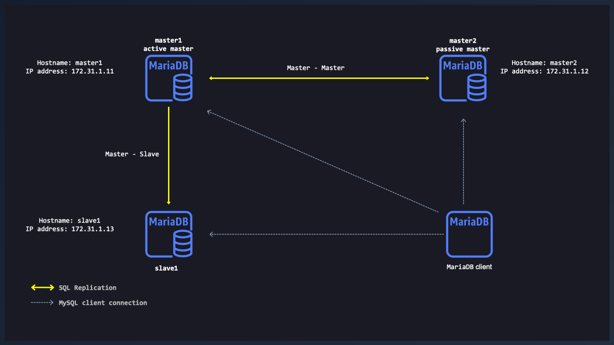

# MariaDB Replication on Docker



### Create a Docker network

```docker
docker network create --driver=bridge --subnet=172.31.1.0/24 --gateway=172.31.1.1 --ip-range 172.31.1.224/27 MariaDB
```

### Create a working directory on your local system

```shell
mkdir -p databases/{master1,master2,slave1}/mysql
```

### Copy fresh MariaDB's configurations files

```docker
docker run -d --name mariadb --env MARIADB_ROOT_PASSWORD=my-secret-pw mariadb
```
```docker
docker cp mariadb:/etc/mysql/mariadb.conf.d/ databases/master1
docker cp mariadb:/etc/mysql/mariadb.conf.d/ databases/master2
docker cp mariadb:/etc/mysql/mariadb.conf.d/ databases/slave1
```
```docker
docker rm -f mariadb
```
```shell
chmod -R 1777 databases/{master1,master2,slave1}/mysql
```

### MariaDB: Configuration of `Master1` Server
Configuration file: `databases/master1/mariadb.conf.d/50-server.cnf`.

```nginx
#
# * master server 'master1' replication setting
#
server_id           = 1 # unique number for each MariaDB/MySQL server in your network.
gtid-domain-id      = 1
binlog-format       = mixed
log_slave_updates   = 1 # set to 1, if the slave is also a master of another slave
log_bin             = /var/log/mysql/mariadb-bin.log  # the path to the update log (log_bin).
log_bin_index       = /var/log/mysql/mariadb-bin.log.index    # which log is currently active and which logs were used earlier.
relay_log           = /var/log/mysql/mariadb-relay-bin    # the replication logs.
relay_log_index     = /var/log/mysql/mariadb-relay-bin.index
expire_logs_days    = 10    # the number of days the logs will be stored.
max_binlog_size     = 100M
bind-address        = 0.0.0.0
replicate_ignore_db = information_schema, mysql, performance_schema, sys    # databases excluded.
auto_increment_increment=2
auto_increment_offset=1
```

### MariaDB: Configuration of `Master2` Server
Configuration file: `databases/master2/mariadb.conf.d/50-server.cnf`.

```nginx
#
# * master server 'master1' replication setting
#
server_id           = 2 # unique number for each MariaDB/MySQL server in your network.
gtid-domain-id      = 2
binlog-format       = mixed
log_slave_updates   = 1 # set to 1, if the slave is also a master of another slave
log_bin             = /var/log/mysql/mariadb-bin.log  # the path to the update log (log_bin).
log_bin_index       = /var/log/mysql/mariadb-bin.log.index    # which log is currently active and which logs were used earlier.
relay_log           = /var/log/mysql/mariadb-relay-bin    # the replication logs.
relay_log_index     = /var/log/mysql/mariadb-relay-bin.index
expire_logs_days    = 10    # the number of days the logs will be stored.
max_binlog_size     = 100M
bind-address        = 0.0.0.0
replicate_ignore_db = information_schema, mysql, performance_schema, sys    # databases excluded.
auto_increment_increment=2
auto_increment_offset=1
```

### MariaDB: Configuration of `Slave1` Server
Configuration file: `databases/slave1/mariadb.conf.d/50-server.cnf`.

```nginx
#
# * slave server 'slave1' replication setting
#
server_id           = 10 # unique number for each MariaDB/MySQL server in your network.
gtid-domain-id      = 3
log_slave_updates   = 1 # Set to 1 if you want to daisy-chain the replicas.
bind-address        = 0.0.0.0
binlog_format       = ROW
log_slave_updates   = 1
log_bin             = binlog
wsrep-restart-slave = 1
relay_log           = /var/log/mysql/mariadb-relay-bin    # the replication logs.
relay_log_index     = /var/log/mysql/mariadb-relay-bin.index
```

### Start the MariaDB servers

#### Start `master1`
```docker
docker run -d --network MariaDB --rm \
--name master1 \
--hostname master1 \
--ip 172.31.1.11 \
-v $PWD/databases/master1/mysql:/var/lib/mysql \
-v $PWD/databases/master1/mariadb.conf.d:/etc/mysql/conf.d \
--env MARIADB_ROOT_PASSWORD=master1 \
--env TZ='America/New_York' \
mariadb
```
#### Start `master2`
```docker
docker run -d --network MariaDB --rm \
--name master2 \
--hostname master2 \
--ip 172.31.1.12 \
-v $PWD/databases/master2/mysql:/var/lib/mysql \
-v $PWD/databases/master2/mariadb.conf.d:/etc/mysql/conf.d \
--env MARIADB_ROOT_PASSWORD=master2 \
--env TZ='America/New_York' \
mariadb
```
#### Start `slave1`
```docker
docker run -d --network MariaDB --rm \
--name slave1 \
--hostname slave1 \
--ip 172.31.1.13 \
-v $PWD/databases/slave1/mysql:/var/lib/mysql \
-v $PWD/databases/slave1/mariadb.conf.d:/etc/mysql/conf.d \
--env MARIADB_ROOT_PASSWORD=slave1 \
--env TZ='America/New_York' \
mariadb
```
### Start the MariaDB clients

#### Start `Client1`
```docker
docker run -it --network MariaDB --rm --name client1 --hostname client1 mariadb mysql --prompt="\u@\h:[\d]>\_" -h master1 -u root -p
```

#### Start `Client2`
```docker
docker run -it --network MariaDB --rm --name client2 --hostname client2 mariadb mysql --prompt="\u@\h:[\d]>\_" -h master2 -u root -p
```

#### Start `Client3`
```docker
docker run -it --network MariaDB --rm --name client3 --hostname client3 mariadb mysql --prompt="\u@\h:[\d]>\_" -h master3 -u root -p
```

### Configuration of `master1`

On `client1` **CLI**, prompt is: `root@master1:[(none)]>`
```sql
STOP SLAVE;
SHOW MASTER STATUS;
```
```sql
GRANT SUPER, RELOAD, REPLICATION SLAVE ON *.* TO 'repl_master2'@'172.31.1.0/255.255.255.0' IDENTIFIED BY 'bigs3cret';
GRANT SUPER, RELOAD, REPLICATION SLAVE ON *.* TO 'repl_slave1'@'172.31.1.0/255.255.255.0' IDENTIFIED BY 'bigs3cret';
FLUSH PRIVILEGES;
FLUSH TABLES WITH READ LOCK;
UNLOCK TABLES;
```
```sql
select user,host from mysql.user;
```

### Configuration of `master2`

On `client2` **CLI**, prompt is: `root@master2:[(none)]>`
```sql
STOP SLAVE;
SHOW MASTER STATUS;
```
```sql
GRANT SUPER, RELOAD, REPLICATION SLAVE ON *.* TO 'repl_master1'@'172.31.1.0/255.255.255.0' IDENTIFIED BY 'bigs3cret';
FLUSH PRIVILEGES;
FLUSH TABLES WITH READ LOCK;
UNLOCK TABLES;
```
```sql
select user,host from mysql.user;
```

### Start the replication on `slave1`:

`master1` ---> `slave1`

On `slave1` **CLI**, prompt is `root@slave1:[(none)]>`.
```sql
CHANGE MASTER TO \
  MASTER_HOST='master1', \
  MASTER_USER='repl_slave1', \
  MASTER_PASSWORD='bigs3cret', \
  MASTER_PORT=3306, \
  MASTER_LOG_FILE='mariadb-bin.000003', \
  MASTER_LOG_POS=1490;
START SLAVE;
```
### Start the replication on `master2`

`master1` ---> `master2`

On `master1` **CLI**, prompt is `root@master1:[(none)]>`.
```sql
CHANGE MASTER TO \
  MASTER_HOST='master2', \
  MASTER_USER='repl_master1', \
  MASTER_PASSWORD='bigs3cret', \
  MASTER_PORT=3306, \
  MASTER_LOG_FILE='mariadb-bin.000003', \
  MASTER_LOG_POS=1039;
START SLAVE;
```

### Start the replication on  `master1`

`master1` <--- `master2`

On `master2` **CLI**, prompt will is `root@master2:[(none)]>`.
```sql
CHANGE MASTER TO \
  MASTER_HOST='master1', \
  MASTER_USER='repl_master2', \
  MASTER_PASSWORD='bigs3cret', \
  MASTER_PORT=3306, \
  MASTER_LOG_FILE='mariadb-bin.000003', \
  MASTER_LOG_POS=1647;
START SLAVE;
```

## Useful Links

Nice and useful links.

- [MariaDB](https://mariadb.com/kb/en/replication-and-binary-log-system-variables/)
- [Nice MySQL training](https://www.mysqltutorial.org/)

## License

This project is licensed under the [MIT license](LICENSE).

[*^ back to top*](#Maria-DB-Replication-on-Docker)
